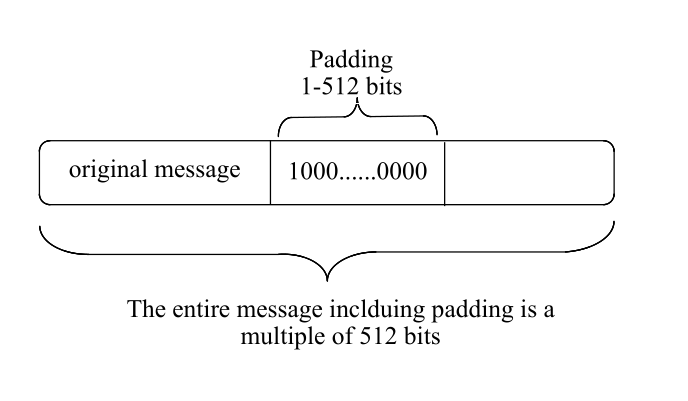
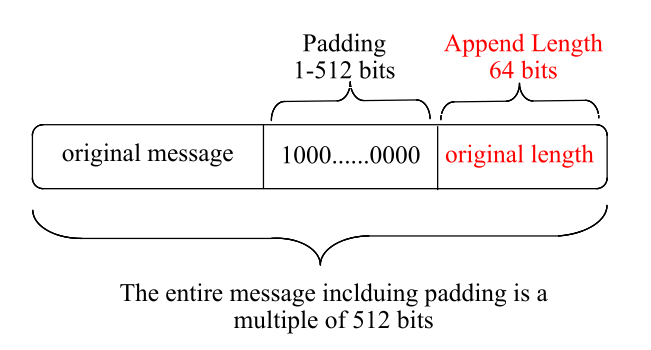
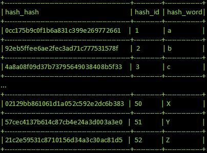

# Introduction
I was required to write a program in the C programming language that calculates the MD5 hash digest of an input. This algorithm is specified in the 'Request For Comments 1321' document supplied by the the Internet Engineering Task Force [1].

This repository is presented with a README.md with a quick description of what was tasked and what the MD5 is by definition. In the directory named `MD5` contains the C file of `main.c` where the code for the MD5 hash digest is located.

Also in this repository is the code breakdown of the SHA-256 hashing algorithm located in the `vidoes` directory. This was done throughout the semester breaking down how hashing algorithms work and what's included, such as padding and unions.

# Run
The following steps will be a guide to download, compile and run the code.
* Clone the repository using the following:
~~~
git clone https://github.com/niemaattarian/Theory-Of-Algorithms.git
~~~
* Navigate to the correct directory if necessary
* The MD5 file can be found at:
~~~
/MD5/main.c
~~~
* Compile the file using the command:
~~~
make main
~~~
* Run the file using the command:
~~~
./main "insert text"
~~~

The compiler used to help compile the code is the *GNU Compiler Collection (GCC)*. This compiler is an integrated distribution of compilers for many well known programming languages such as C, C++, Objective-C, etc [2].

The following steps will be a guide to download and install the compiler:

#### Linux
* Open up a terminal and enter:
~~~
$ sudo apt install gcc
~~~
* To confirm and/or check your version of installation enter the following:
~~~
$ gcc --version
~~~
* If done correctly, the following information should be displayed:
~~~
gcc (Arch Linux 9.3.0-1) 9.3.0
Copyright (C) 2019 Free Software Foundation, Inc.
This is free software; see the source for copying conditions.  There is NO
warranty; not even for MERCHANTABILITY or FITNESS FOR A PARTICULAR PURPOSE.
~~~

# Test

# Algorithm
The MD5 algorithm takes in a message input of arbitrary length producing an output of 128-bit message digest. It is considered to be a pseudorandom hashing algorithm meaning it is computationally impossible that the MD5 message digest, of different input, can produce two messages of the exact same message digest [3]. Any slight change of the string input can drastically change the hashed output. Below is a small example;
~~~
String Input:   abc
Hashed Output:  900150983cd24fb0d6963f7d28e17f72
___________________________________________________

String Input:   abd
Hashed Output:  4911e516e5aa21d327512e0c8b197616
~~~
The MD5 algorithm is divided up into 5 steps; *Appending Padding Bits*, *Appending Length*, *Initialize MD Buffer*, *Process Message in 16-Word Blocks* and finally the *Hashed Output*.

### 1. Append Padding Bits
*Padding the bits* in the MD5 algorithm is essentially extending the length of a b-bit message input. This is done to ensure that the length is congruent to 448, modulo 512[3]. This extension ensures that the message is 64-bits shy of the 512-bits. This padding is always done regardless of the length of the message, even if it is already congruent to 448, modulo 512.

***How is padding performed?***

The padding is done by appending **'0'** and **'1'** bits in the beginning and end of the message respectively so that the resulting bit length that was not congruent to 448, modulo 512 is finally congruent [4].

### 2. Append Length
*Appending the length* includes adding the b-bit message input towards the end of the padding in the form of a 64-bit representation. This addition is already padded.

### 3. Initialize MD Buffer
This step entails the initialising of a 32-bit number in the form of variables. These variables are initialised in hexadecimal values as shown:
~~~
A:  01 23 45 67
B:  89 ab cd ef
C:  fe dc ba 98
D:  76 54 32 10
~~~

### 4. Process Message in 16-Word Blocks
This process begins by initialising four auxiliary functions that take three 32-bit words as an input and output one 32-bit word.

~~~
(B and C) or ((not B) and D)
(D and B) or ((not D) and C)
B xor C xor D
C xor (B or (not D))
~~~

These auxiliary functions are shown as:

~~~
(B & C) | ((~B) & D)
(D & B) | ((~D) & C)
B ^ C ^ D
C ^ (B | (~D))
~~~

***************** write more here ****

For each of the 512-bit chunk of padded message, it must be divided into sixteen 32-bit words as follows:

~~~
for(int chunk = 0; chunk < new_length; chunk += 64)
    {
        uint32_t *M = (uint32_t *) (message + chunk);
~~~

***************** write more here ****

The main loop uses a 64-element table constructed from the sine function [1]. It done using the auxiliary functions to complete the logic.

~~~
for(i = 0; i < 64; i++) {
            
int32_t F, g;

    if(i < 16){
        F = (B & C) | ((~B) & D);
        g = i;
    }
    else if(i < 32){
        F = (D & B) | ((~D) & C);
        g = ((5 * i) + 1) % 16;
    }
    else if(i < 48){
        F = B ^ C ^ D;
        g = ((3 * i) + 5) % 16;
    }
    else {
        F = C ^ (B | (~D));
        g = (7 * i) % 16;
    }
}
~~~

### 5. Hashed Output
The hashed message is outputted as A, B, C, D. This is because we begin with the low order byte of A and finish with the high end order byte of D [1].

# Complexity
Hashing functions are widely used for many reasons. These include securing passwords by hashing them, cryptocurrencies like Bitcoin, certifications and transferring/storing large chunks of data. Examples of the algorithms used mainly consist of *MD4*, *MD5*, *SHA-1* and *SHA-256*. Many of these hashing functions include one-way encryption functions that take an input of any size plaintext and generate a specific sized hashed output. These hashed outputs are extremely hard to decipher and crack. It is said to be computationally impossible to reverse engineer these functions. However, as complex as they seem, some of them (like the MD5 message digest) have been exposed and compromised in different ways.

### MD5 Security Issues
Although the MD5 algorithm was once considered a secure algorithm, over time it has been prone to two main types of attacks; *dictionary attacks* and *rainbow tables* [5].

#### Type of attacks

##### 1. Rainbow Table
Rainbow tables are one of the most efficient attacks to crack passwords that are stored using hashing algorithms. Although it is not wise to store a password using MD5, rainbow table attacks have been used to crack it.

Rainbow Tables are essentially huge tables filled with predefined hash values used to find specific passwords.

[7]

The attacker hashes and loads a large number of predefined hashed passwords, some of which would be commonly used and compares them with the stored hashed passwords in a system search for a match of hashes. This method is used to crack passwords in the shortest amount of time compared to  other techniques. Although this is an efficient method for cracking passwords, it is highly storage inefficient [6]. The rainbow table attacks have been used on applications using MD5 and SHA-1 in the past, hence, storing passwords using these algorithms aforementioned are highly advised against.

##### 2. Collision Attacks
Collision attacks express circumstances where two non-identical data files or sets produce an identical hash value when calculated. Although considered computationally infeasible for two different files to produce an identical hashed output, in 2005, hashing collision was achieved by Xiaoyun Wang and Hongbo Yu of the Shandong University in China. They presented their research findings detailing how they the cracked the MD5 hash function [8][9].

The research describes how hash collisions between two non-identical files was achieved. These two non-identical files were structured a specific way by the researchers that the mathematical process used in the hashing process was higher than the probability to generate these hash values at random [8][9]. Even though this method created a collision of files, it included specific input blocks which, the probability of these specific blocks appearing randomly is highly improbable[10].

#### Countermeasures to these attacks

##### 1. Salting
The process of *salting* is an additional security feature used for hashing algorithms in the case of storing hashed passwords. Even though it was previously mentioned that MD5 was not advised in storing passwords, if storing them was the case, salting would be a viable addition to prevent any possible security concerns. LinkedIn was a prime example of storing passwords using a hash function without salting preemptively done.

***How does salting work?***

Salting is considered to be a secondary piece of information in the form of a string of characters which are added to the initial plaintext input [5]. Together, these are hashed. The hashed output of these will differ extremely .

Here is an example of a plaintext password input hashed:
~~~
String Input:   password
Hashed Output:  5f4dcc3b5aa765d61d8327deb882cf99
~~~

Here is an example of a plaintext password input *salted* and then hashed:
~~~
String Input:   passwordOfe3
Hashed Output:  1ba15b93d9409a0d4bf77f967cdbf9d6
~~~

Note the difference in these hashed outputs. Password storing systems will contain a list of predefined salts which they add to these passwords. This method makes it extremely difficult for anyone to preform any Dictionary/Rainbow Table attacks.

##### 2. Increased Randomness
To prevent a lot of well-known attacks such as *colllision attacks*, *preimage attacks* and *birthday attacks*, increasing the randomness of hashing algorithms can reduce the likelihood of these attacks succeeding.

In terms of the aforementioned collision attack, increasing the randomness will counter and reduce any risk. The method of message pre-processing can be useful before the hashing of the message. In doing this, the idea of the message being more random before hashing reduces redundancy in the input data leading to a much lower probability of finding a collision [11].

# Conclusion

# References

[1] Rivest, R., 1992. RFC1321: The MD5 message-digest algorithm.

[2] Stallman, R.M., 1988. Using the GNU Compiler Collection. For GCC version, 4(2).

[3] Rivest, R. and Dusse, S., 1992. The MD5 message-digest algorithm.

[4] Gupta, P. and Kumar, S., 2014. A comparative analysis of SHA and MD5 algorithm. architecture, 1, p.5.

[5] Ah Kioon, M.C., Wang, Z.S. and Deb Das, S., 2013. Security analysis of md5 algorithm in password storage. In Applied Mechanics and Materials (Vol. 347, pp. 2706-2711). Trans Tech Publications Ltd.

[6] Kumar, H., Kumar, S., Joseph, R., Kumar, D., Singh, S.K.S. and Kumar, P., 2013, April. Rainbow table to crack password using MD5 hashing algorithm. In 2013 IEEE Conference on Information & Communication Technologies (pp. 433-439). IEEE.

[7] Privacy Canada. 2020. Rainbow Tables - Privacy Canada. [online] Available at: <https://privacycanada.net/hash-functions/rainbow-tables/> [Accessed 25 April 2020].

[8] Schmitt, V. and Jordaan, J., 2013. Establishing the validity of MD5 and SHA-1 hashing in digital forensic practice in light of recent research demonstrating cryptographic weaknesses in these algorithms. International Journal of Computer Applications, 68(23).

[9] Wang, X. and Yu, H., 2005, May. How to break MD5 and other hash functions. In Annual international conference on the theory and applications of cryptographic techniques (pp. 19-35). Springer, Berlin, Heidelberg.

[10] Thompson, E., 2005. MD5 collisions and the impact on computer forensics. Digital investigation, 2(1), pp.36-40.

[11] Peer to Patent. 2020. Method For Preventing And Detecting Hash Collisions Of Data During The Data Transmission - Peer To Patent. [online] Available at: <https://www.peertopatent.org/method-for-preventing-and-detecting-hash-collisions-of-data-during-the-data-transmission/> [Accessed 25 April 2020].
